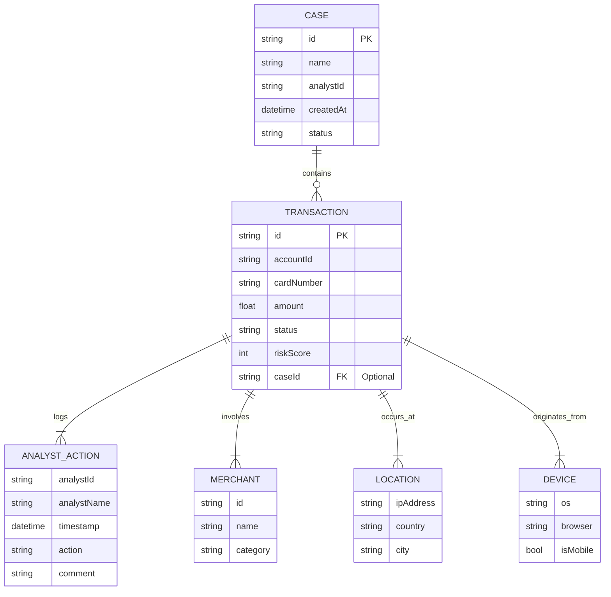

# Fraud Detection Analyst Console

---

## **TITLE PAGE**

### A Real-Time, End-to-End Fraud Detection System Analyst Console

A Project Report Submitted in Partial Fulfillment of the Requirements for the Degree of


---

## **BONAFIDE CERTIFICATE**

> Certified that this project report, **“A Real-Time, End-to-End Fraud Detection System Analyst Console”**, is the bonafide work of **[Your Name] ([Your ID/Roll Number])** who carried out the project work under my supervision.
>
> ---
> **Signature of Head of Department**
>
> **[HOD's Name]**
>
> **[Department Name]**
>
> ---
> **Signature of Supervisor**
>
> **[Guide's Name]**
>
> **[Designation]**

---

## **PROJECT TITLE**

**A Real-Time, End-to-End Fraud Detection System Analyst Console**

---

## **PROJECT DESCRIPTION**

### **Abstract**

This project is a sophisticated, real-time frontend application designed for fraud analysts. It provides a dynamic and interactive web console to review, investigate, and act upon suspicious financial transactions flagged by a backend machine learning system. The primary goal is to empower analysts to make faster, more accurate decisions by presenting complex data in an intuitive and actionable format.

The application simulates a live stream of incoming transaction alerts and equips the analyst with a suite of professional-grade tools to handle a high-volume workload efficiently. It features a rich, visually appealing interface with a "Golden and Purple" theme, enhanced by subtle background imagery and animations to create an immersive user experience.

### **Key Features Implemented**

-   **Real-Time Alert Queue**: A continuously updating list of suspicious transactions, with new alerts highlighted to draw immediate attention.
-   **Dynamic Search & Filtering**: Instantly search the queue by Transaction ID, Account ID, or Merchant Name, and filter alerts by their status (`Pending`, `Approved`, `Blocked`, `Escalated`).
-   **Comprehensive Detail View**: A dedicated workspace for each alert, featuring:
    -   A visual **Risk Score Gauge** for at-a-glance assessment.
    -   **Human-Readable Explanations** detailing the features contributing to the risk score.
    -   Complete transaction, merchant, location, and device information.
-   **Account Activity Timeline**: A visual timeline of the customer's recent transaction history to quickly identify unusual patterns.
-   **Analyst Action Panel**: A section for analysts to `Approve`, `Block`, or `Escalate` a transaction after adding mandatory audit comments.
-   **Persistent Action History**: All actions are logged and displayed, providing a clear audit trail.
-   **Case Management**: Allows analysts to group related alerts into a single "case" for investigating coordinated fraud rings.
-   **Keyboard Shortcuts**: Productivity-enhancing shortcuts (`J`/`K` for navigation, `A`/`B`/`E` for actions) for power users.
-   **Real-time Collaboration Indicator**: A simulated indicator to prevent duplicate work by showing if another analyst is viewing the same alert.
-   **Dashboard Widgets**: A high-level statistics panel displaying key metrics like pending alerts, daily resolutions, and average handling time.

---

## **HARDWARE/SOFTWARE REQUIREMENT**

### **Frontend (This Project)**

-   **Hardware**:
    -   Standard Desktop or Laptop PC
    -   Minimum 4GB RAM
    -   Modern Multi-core CPU
-   **Software**:
    -   Operating System: Windows, macOS, or Linux
    -   Web Browser: Google Chrome, Mozilla Firefox, Safari, or Microsoft Edge (latest versions)
    -   Development Environment: Node.js (v16.x or newer), npm / yarn

### **Full System (Conceptual Backend)**

-   **Backend**: Node.js with Express.js
-   **Database**: MongoDB
-   **Streaming Platform**: Apache Kafka
-   **Machine Learning Model Serving**: Python (Flask/FastAPI) or ONNX Runtime

---

## **ER DIAGRAM**

This diagram illustrates the relationships between the primary data entities in the application.



---

## **SCHEMA**

The core data structures of the application are defined in `types.ts`.

### **Transaction Schema**

This is the central data object representing a single financial event.

```typescript
export interface Transaction {
  id: string;
  accountId: string;
  cardNumber: string; // Masked
  amount: number;
  currency: string;
  timestamp: number;
  status: 'Pending' | 'Approved' | 'Blocked' | 'Escalated';
  merchant: Merchant;
  location: Location;
  device: Device;
  riskScore: number;
  reason: {
    summary: string;
    contributingFeatures: EngineeredFeature[];
  };
  analystActions: AnalystAction[];
  caseId?: string; // Optional link to a Case
}
```

### **Case Schema**

Represents a collection of related transactions under a single investigation.

```typescript
export interface Case {
    id: string;
    name: string;
    analystId: string;
    createdAt: number;
    status: 'Open' | 'Closed';
    transactionIds: string[];
}
```

---

## **FRONT-END SCREENS**

The user interface is divided into several key components that form the analyst's workspace.

### **1. Main Dashboard & Alert Queue**
The initial view presents the dashboard widgets for an at-a-glance summary and the live queue of suspicious transactions.


### **2. Transaction Details View**
When a transaction is selected, this view provides an in-depth analysis workspace with risk gauges, timelines, and action panels.


### **3. Case Management Panel**
Within the details view, this panel allows analysts to create a new investigation case or add the current transaction to an existing one.


---

## **OUTPUT SCREENS**

The "output" of the application is the result of an analyst's actions, which updates the system state in real-time.

### **1. Action Logged in History**
After an analyst submits a comment and takes an action (e.g., Block), it immediately appears in the "Action History" with a timestamp and audit trail.


### **2. Status Updated in Queue**
The status of the transaction is instantly updated in the main queue, changing its color-coded badge and affecting filter results.


---

## **LIMITATION & FUTURE SCOPE**

### **Limitations**

1.  **Mock API**: The application runs on a mock API (`services/mockApi.ts`) that simulates data. It does not connect to a real backend, database, or Kafka stream.
2.  **Simulated Collaboration**: The "real-time collaboration indicator" is a simulation to demonstrate the UI/UX. A production version would require WebSockets connected to a backend service.
3.  **Frontend-Only Logic**: All state management is handled on the client-side. In a real system, actions would trigger API calls to a persistent backend.
4.  **No Authentication**: The application assumes a single, authenticated user ("Diana") and does not have a login or role-based access control system.

### **Future Scope**

1.  **Full Backend Integration**: Connect the frontend to a real MERN stack backend with live data from a Kafka stream. Replace mock API calls with real HTTP/WebSocket communication.
2.  **Gemini API Integration**: Introduce an "AI-Powered Summary" feature where analysts can click a button to send transaction data to the Gemini API and receive an automated risk assessment and recommended action.
3.  **Advanced Visualizations**: Implement interactive maps to visualize transaction geography and network graphs for link analysis to uncover complex fraud rings.
4.  **User Authentication & Roles**: Add a complete authentication system (e.g., using JWT) with different roles and permissions (e.g., Analyst, Senior Analyst, Admin).
5.  **Machine Learning Feedback Loop**: Implement functionality to export analyst-labeled data (Approved/Blocked) in a format suitable for periodically retraining the fraud detection model.

---

## **GITHUB URL**

The complete source code for this project is available on GitHub.

[Project Repository](https://github.com/your-username/your-repo)

---

## **PPT SLIDES**

A presentation for this project could be structured as follows:

1.  **Slide 1: Title Slide** - Project Title, Your Name, Institution.
2.  **Slide 2: Problem Statement** - The challenge of real-time fraud detection and the need for efficient analyst tools.
3.  **Slide 3: Project Objectives** - What the project aims to achieve.
4.  **Slide 4: System Architecture** - High-level diagram of the conceptual end-to-end system (Kafka -> Backend -> Frontend).
5.  **Slide 5: Technology Stack** - List of technologies used (React, TypeScript, Tailwind CSS, etc.).
6.  **Slide 6: Core Features Demo** - Screenshots/GIFs of the Alert Queue, Search, and Filtering.
7.  **Slide 7: Deep Dive: Investigation View** - Showcase the Risk Gauge, Timeline, and Details panel.
8.  **Slide 8: Advanced Features Demo** - Showcase Case Management, Keyboard Shortcuts, and Collaboration.
9.  **Slide 9: ER Diagram & Schema** - Briefly explain the data model.
10. **Slide 10: Limitations** - Discuss the current limitations of the implementation.
11. **Slide 11: Future Scope & Enhancements** - Talk about potential improvements like AI integration.
12. **Slide 12: Q&A** - Thank you slide.

---

## **PROJECT CODE**

### **File Structure**

The project is organized into a modular structure for clarity and maintainability.

```
/
├── public/
├── src/
│   ├── components/
│   │   ├── common/         # Reusable UI components (Button, Badge)
│   │   ├── icons/          # SVG icon components
│   │   ├── AccountTimeline.tsx
│   │   ├── AlertDetails.tsx
│   │   ├── AlertItem.tsx
│   │   ├── AlertsQueue.tsx
│   │   ├── CollaborationIndicator.tsx
│   │   ├── DashboardWidgets.tsx
│   │   ├── Header.tsx
│   │   └── RiskScoreGauge.tsx
│   ├── services/
│   │   └── mockApi.ts      # Simulates backend data and logic
│   ├── App.tsx             # Main application component, state management
│   ├── index.tsx           # Entry point of the React application
│   └── types.ts            # TypeScript type definitions and interfaces
├── index.html              # Main HTML file
├── README.md               # Project documentation
└── metadata.json           # Application metadata
```

### **Key Files**

-   **`App.tsx`**: The heart of the application. It manages global state (transactions, cases, selected alert), handles keyboard shortcuts, and orchestrates the interaction between different components.
-   **`services/mockApi.ts`**: Simulates a live backend by generating realistic transaction data on the fly. It manages the in-memory state of cases and analyst actions.
-   **`types.ts`**: Provides static typing for all data structures, ensuring code quality and preventing common errors.
-   **`components/AlertDetails.tsx`**: A complex component that serves as the main investigation workspace for the analyst.

---

## **REFERENCES**

-   React.js Official Documentation: [https://reactjs.org/](https://reactjs.org/)
-   TypeScript Official Documentation: [https://www.typescriptlang.org/](https://www.typescriptlang.org/)
-   Tailwind CSS Official Documentation: [https://tailwindcss.com/](https://tailwindcss.com/)
-   Mermaid.js Documentation (for diagrams): [https://mermaid-js.github.io/](https://mermaid-js.github.io/)

---

## **BIBLIOGRAPHY**

-   "Designing Data-Intensive Applications" by Martin Kleppmann - For concepts on building scalable and reliable systems like the conceptual backend.
-   "React - The Complete Guide" by Maximilian Schwarzmüller - For in-depth knowledge of React and modern frontend development patterns.
